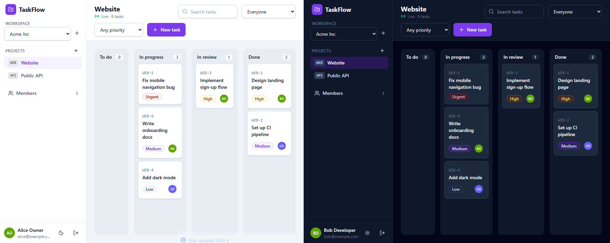
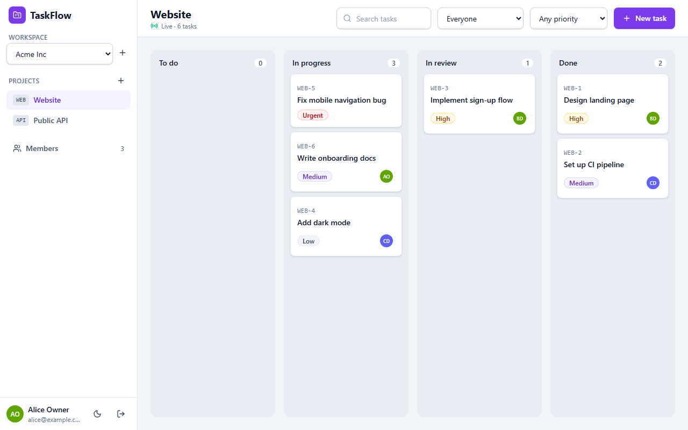
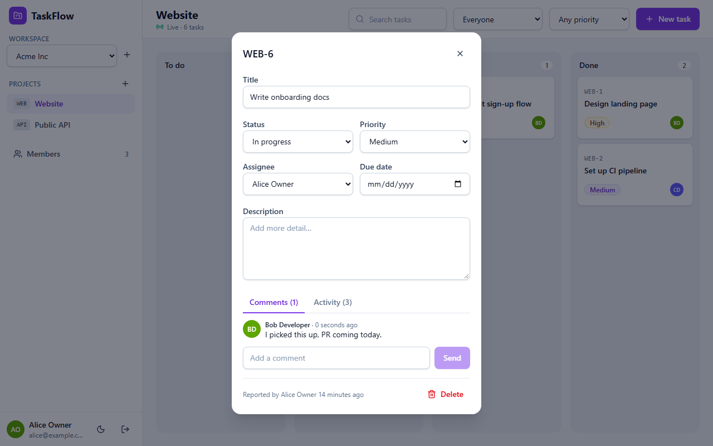
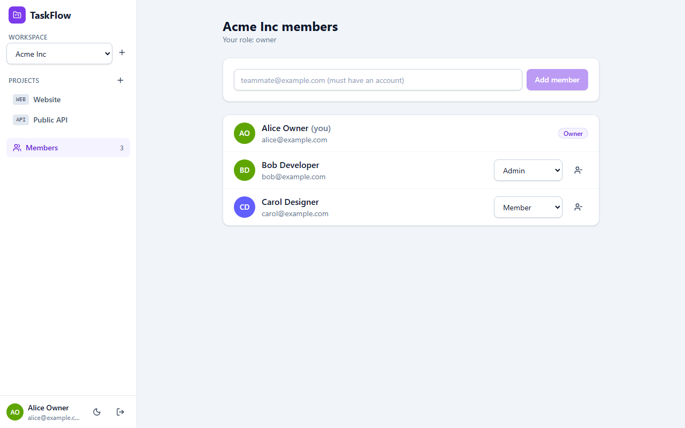
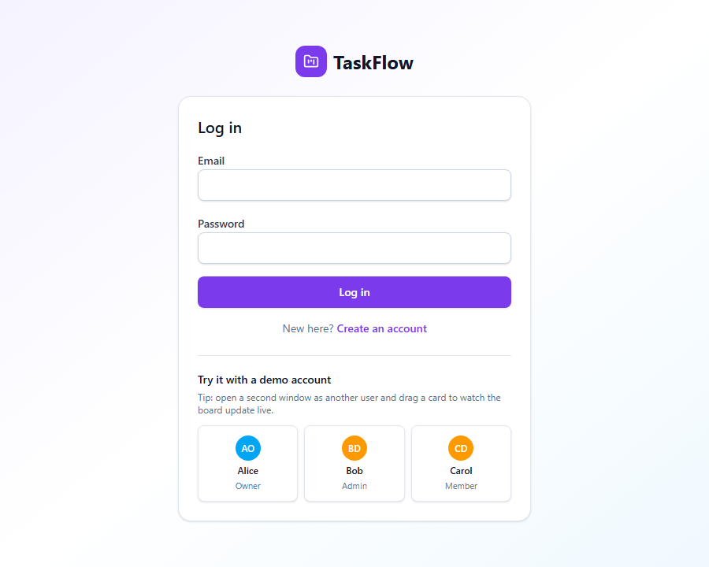
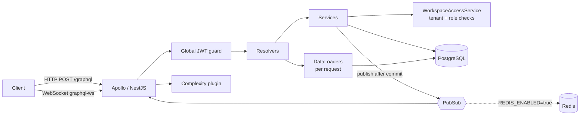

# TaskFlow GraphQL API + web app

[](https://github.com/ebrahimmorkas/taskflow-graphql-api/actions/workflows/ci.yml)


A multi-tenant project management backend in the style of Jira or Linear, built with **NestJS**
and **GraphQL**. Teams work in isolated workspaces with roles, and each workspace holds projects
and tasks with human keys like `WEB-42`. Everything is audited in an activity log, and changes
stream to clients in real time over GraphQL subscriptions.

It ships with a **React + TypeScript web app** in [`client/`](client): a kanban board that
updates live for everyone in the project.



## Highlights

| Concern                 | How it's handled                                                                                                                                                                                       |
| ----------------------- | ------------------------------------------------------------------------------------------------------------------------------------------------------------------------------------------------------ |
| **Tenant isolation**    | Every workspace-scoped operation goes through one `WorkspaceAccessService.require(user, workspace, minRole)`. Other tenants' ids return `NOT_FOUND`, so they can't be probed.                          |
| **Race-free task keys** | `WEB-1, WEB-2…` come from one atomic `UPDATE projects SET "taskCounter" = "taskCounter" + 1 … RETURNING` in the insert transaction. Tested with 15 concurrent creates; a unique index is the backstop. |
| **N+1 queries**         | Request-scoped **DataLoaders** batch `assignee`, `reporter`, `project` and `actor`. A test asserts a 25-task page with all relations runs in a constant number of SQL queries.                         |
| **Abusive queries**     | A query-complexity plugin rejects over-budget operations before execution. List fields cost `page.first × children`.                                                                                   |
| **Pagination**          | Relay-style connections (`edges`, `pageInfo`, `totalCount`) with opaque cursors, stable under concurrent inserts.                                                                                      |
| **Real time**           | `taskChanged(projectId)` and `commentAdded(taskId)` over **graphql-ws**. The WebSocket authenticates with a JWT, and access is checked when each subscription starts.                                  |
| **Horizontal scaling**  | With `REDIS_ENABLED=true`, subscriptions use Redis PubSub. CI runs a two-instance test where a mutation on instance A reaches a subscriber on instance B.                                              |
| **Audit trail**         | Each change stores field-level `from → to` diffs (jsonb) plus who made it.                                                                                                                             |
| **Invariants**          | A workspace always keeps at least one owner, enforced under `SELECT … FOR UPDATE`.                                                                                                                     |
| **Consistent errors**   | Every error carries a stable `extensions.code` (`NOT_FOUND`, `FORBIDDEN`, `BAD_USER_INPUT`, `QUERY_TOO_COMPLEX`…) and no stack traces leak.                                                            |

## Web client

| Kanban board                             | Task with live comments and activity log |
| ---------------------------------------- | ---------------------------------------- |
|      |        |
| **Workspace members and roles**          | **Login with demo accounts**             |
|  |      |

What it does:

- **Board** with four columns. Move cards by drag-and-drop or with Alt+←/→ on the keyboard.
  Filter by text, assignee and priority. Overdue dates are highlighted.
- **Live for the whole team:** a `taskChanged` subscription updates every open board, with a
  toast such as "Bob updated WEB-5". Comments on an open task arrive through `commentAdded`.
- **Task dialog:** edit title, description, status, priority, assignee and due date; comment;
  read the audit trail ("status: To do → In progress").
- **Workspaces and projects:** switch workspace, create workspaces and projects, add members by
  email, change roles, remove members. Controls follow the user's role.
- One-click demo users (owner, admin, member), light and dark themes, responsive layout.

How it is built:

- **React 19 + TypeScript + Vite**, React Router, Tailwind CSS v4, React Hook Form + Zod.
- **A 100-line GraphQL client** (`fetch` + typed results + the API's error codes) and
  **`graphql-ws`** for subscriptions, authenticated through `connectionParams`. Caching is
  handled by **TanStack Query**.
- **Optimistic drag-and-drop:** the card moves immediately and rolls back if the mutation fails.
  Subscription events and mutation results go through one pure reducer (`applyTaskEvent`), which
  ignores events older than the cached copy, so out-of-order updates can't undo a newer change.
- **Works within the API's query-complexity limit:** the board loads tasks in small pages and
  follows the cursor until it has them all.
- **Tests:** Vitest unit tests for the board reducer, filters, grouping and overdue logic. CI
  lints, typechecks, tests and builds the client.

## Tech stack

**NestJS 12** (ESM), **TypeScript** (strict), **GraphQL** code-first with Apollo Server 5,
**TypeORM** with **migrations**, **PostgreSQL**, graphql-ws subscriptions, DataLoader,
class-validator, JWT, bcrypt, Zod-validated config, Terminus health checks, **optional Redis**
(PubSub), Vitest e2e tests, Docker, GitHub Actions and oxlint.

## Architecture



```
Workspace ─┬─ Membership (OWNER | ADMIN | MEMBER) ── User
           └─ Project (key: WEB) ── Task (WEB-42) ─┬─ Comment
                                                   └─ Activity (field diffs)
```

### Running with or without Redis

|                        | `REDIS_ENABLED=false` (default) | `REDIS_ENABLED=true`    |
| ---------------------- | ------------------------------- | ----------------------- |
| Subscription transport | In-memory PubSub                | Redis PubSub            |
| Deployment             | Single instance                 | Any number of instances |

## Getting started

### Docker

```bash
docker compose up --build                                   # API + PostgreSQL
REDIS_ENABLED=true docker compose --profile redis up --build # + Redis
```

### Local Node.js

Requirements: Node.js 20+, PostgreSQL 14+ (Redis optional).

```bash
git clone https://github.com/ebrahimmorkas/taskflow-graphql-api.git
cd taskflow-graphql-api
cp .env.example .env
npm install
npm run migration:run
npm run db:seed          # demo workspace; users alice/bob/carol@example.com, password Password123
npm run start:dev        # http://localhost:3001/graphql (Apollo Sandbox)

# Web client (proxies /graphql, including the subscription WebSocket, to :3001)
npm run db:seed          # demo users alice/bob/carol@example.com, password Password123
cd client
npm install
npm run dev              # http://localhost:5176
```

## Example operations

```graphql
mutation {
  logIn(input: { email: "alice@example.com", password: "Password123" }) {
    token
  }
}
```

Send `Authorization: Bearer <token>` with every other operation.

```graphql
query Board($projectId: ID!) {
  tasks(projectId: $projectId, filter: { status: [TODO, IN_PROGRESS] }, page: { first: 20 }) {
    totalCount
    pageInfo {
      hasNextPage
      endCursor
    }
    edges {
      node {
        key
        title
        status
        priority
        dueDate
        assignee {
          name
        }
        activity {
          type
          actor {
            name
          }
          changes {
            field
            from
            to
          }
        }
      }
    }
  }
}

mutation {
  updateTask(input: { id: "…", status: IN_REVIEW, assigneeId: "…" }) {
    key
    status
  }
}

subscription ($projectId: ID!) {
  taskChanged(projectId: $projectId) {
    type
    taskId
    task {
      key
      title
      status
    }
  }
}
```

WebSocket clients pass the token in `connectionParams`:

```ts
createClient({
  url: 'ws://localhost:3001/graphql',
  connectionParams: { authorization: `Bearer ${token}` },
});
```

## API surface

| Area       | Queries / Mutations / Subscriptions                                                                                        |
| ---------- | -------------------------------------------------------------------------------------------------------------------------- |
| Auth       | `signUp`, `logIn`, `me`                                                                                                    |
| Workspaces | `myWorkspaces`, `workspace`, `createWorkspace`, `addWorkspaceMember`, `updateWorkspaceMemberRole`, `removeWorkspaceMember` |
| Projects   | `projects`, `project`, `createProject`, `updateProject`, `archiveProject`                                                  |
| Tasks      | `tasks` (connection), `task`, `taskByKey`, `createTask`, `updateTask`, `deleteTask`, `taskChanged`                         |
| Comments   | `addComment`, `Task.comments`, `commentAdded`                                                                              |
| System     | `system`, `GET /health`                                                                                                    |

The schema is generated from code (`schema.gql` is written on start) and fully introspectable.

### Permissions

| Action                                                        | Required role |
| ------------------------------------------------------------- | ------------- |
| Read workspace, projects, tasks; create/update tasks; comment | MEMBER        |
| Create/update/archive projects, add members, delete any task  | ADMIN         |
| Change roles, grant ownership                                 | OWNER         |
| Delete own task / leave workspace                             | self          |

## Configuration

| Variable                 | Default                  | Description                                 |
| ------------------------ | ------------------------ | ------------------------------------------- |
| `PORT`                   | `3001`                   | HTTP/WebSocket port                         |
| `DATABASE_URL`           | —                        | PostgreSQL connection string (**required**) |
| `DB_MIGRATIONS_RUN`      | `true`                   | Apply pending migrations on startup         |
| `JWT_SECRET`             | —                        | ≥ 32 characters (**required**)              |
| `JWT_TTL`                | `1d`                     | Token lifetime                              |
| `REDIS_ENABLED`          | `false`                  | Use Redis PubSub for subscriptions          |
| `REDIS_URL`              | `redis://localhost:6379` | Redis connection                            |
| `GRAPHQL_MAX_COMPLEXITY` | `300`                    | Maximum estimated query cost                |
| `CORS_ORIGIN`            | `*`                      | Allowed origins (comma-separated)           |

## Database migrations

The schema is managed by TypeORM migrations (`synchronize` is off):

```bash
npm run migration:generate -- src/database/migrations/AddSomething   # diff entities vs DB
npm run migration:run
npm run migration:revert
```

Entities and migrations are registered explicitly (`src/database/entities.ts`,
`src/database/migrations/index.ts`), so the same config works from `src`, `dist` and tests.

## Testing

```bash
npm run test:e2e                         # needs PostgreSQL (TEST_DATABASE_URL)
REDIS_ENABLED=true npm run test:e2e      # + cross-instance subscription test
```

The e2e suite runs against a real database. It creates `taskflow_test`, applies migrations and
truncates between tests. It covers auth, tenancy isolation, role rules, concurrent numbering,
pagination, DataLoader batching, the activity log, complexity limits and subscriptions using a
real `graphql-ws` client.

CI also **boots the compiled `dist/` build** against PostgreSQL, which catches runtime-only
problems that transpiled tests can't see.

## Project structure

```
src/
├── app.module.ts           # GraphQL (Apollo), TypeORM, config, subscriptions, loaders
├── auth/                   # JWT, global guard, @Public/@CurrentUser
├── workspaces/             # tenancy, memberships, WorkspaceAccessService
├── projects/               # projects + project-level access helper
├── tasks/                  # tasks, activity log, connection pagination, taskChanged
├── comments/               # comments + commentAdded
├── pubsub/                 # PubSub port: memory / Redis
├── common/                 # errors, error formatter, DataLoaders, complexity plugin
├── database/               # TypeORM config, migrations, seed
└── health/                 # Terminus health check
test/                       # Vitest e2e suites + helpers
```

## Possible extensions

- Labels, sprints and a Kanban board ordering (fractional indexing)
- Email and in-app notifications via a queue
- Persisted queries and response caching
- Row-level security in PostgreSQL as defence in depth for tenancy

## License

[MIT](LICENSE)
